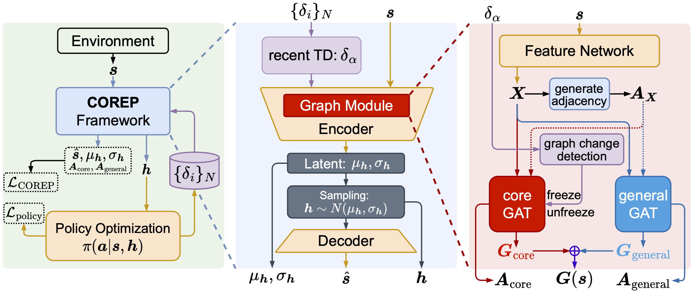

# 📄 Tackling Non-Stationarity in Reinforcement Learning via Causal-Origin Representation


      
The official repository of our [[Paper]](https://arxiv.org/pdf/2306.02747) at **ICML 2024**.



COREP primarily employs a dual-GAT structure with a guided updating mechanism to learn a stable graph representation for states, termed as causal origin representation. By leveraging this representation, the learned policy exhibits resilience to non-stationarity. The overall framework of COREP is illustrated in the above figure.


The code is coming out soon!

## Citation

If you find our work useful in your research and would like to cite our project, please use the following citation:
```
@article{zhang2023tackling,
  title={Tackling Non-Stationarity in Reinforcement Learning via Causal-Origin Representation},
  author={Zhang, Wanpeng and Li, Yilin and Yang, Boyu and Lu, Zongqing},
  journal={arXiv preprint arXiv:2306.02747},
  year={2023}
}
```

